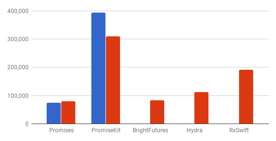
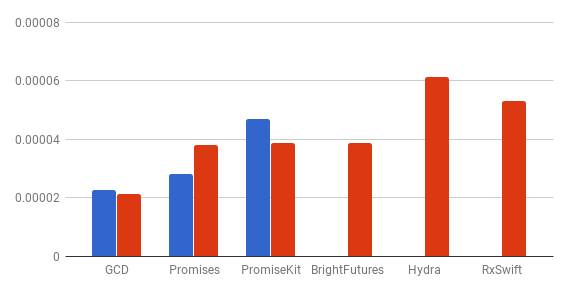
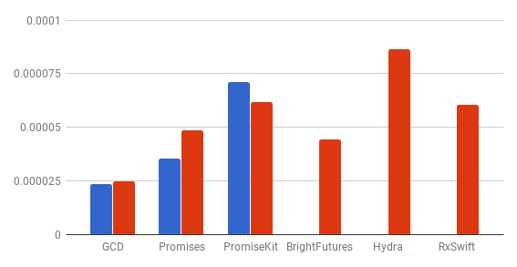
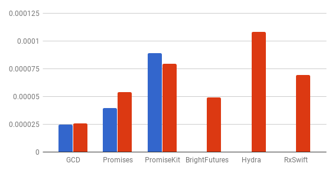
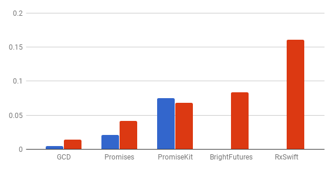

# Promises

This guide provides an overview of
[Promises](https://github.com/google/promises) framework for Objective-C and
Swift.

## Introduction

### The problem with async code

Typically, async operations take a completion handler in a form of a block,
which is called to provide either a result or an error. To perform more than one
async operation, you have to nest the second one inside the completion block of
the first one, and also handle an error gracefully. Often such nesting becomes
painful to follow or modify:

Objective-C:

```objectivec
- (void)getCurrentUserContactsAvatars:(void (^)(NSArray<UIImage *> *, NSError *))completion {
  [MyClient getCurrentUserWithCompletion:^(MyUser *currentUser, NSError *error) {
    if (error) {
      completion(nil, error);
      return;
    }
    [MyClient getContactsForUser:currentUser
                      completion:^(NSArray<MyContact *> *contacts, NSError *error) {
      if (error) {
        completion(nil, error);
        return;
      }
      if (contacts.count == 0) {
        completion(@[], nil);
        return;
      }
      NSMutableArray<UIImage *> *avatars = [NSMutableArray array];
      NSUInteger __block count = contacts.count;
      BOOL __block errorReported = NO;
      for (NSUInteger index = 0; index < count; ++index) {
        [avatars addObject:[NSNull null]];
      }
      [contacts enumerateObjectsUsingBlock:^(MyContact *contact, NSUInteger index, BOOL __unused *_) {
        [MyClient getAvatarForContact:contact completion:^(UIImage *avatar, NSError *error) {
          if (errorReported) {
            return;
          }
          if (error) {
            completion(nil, error);
            errorReported = YES;
            return;
          }
          if (avatar) {
            avatars[index] = avatar;
          }
          if (--count == 0) {
            completion(avatars, nil);
          }
        }];
      }];
    }];
  }];
}
```

Swift:

```swift
func getCurrentUserContactAvatars(_ completion: ([UIImage]?, Error?) -> Void) {
  MyClient.getCurrentUser() { currentUser, error in
    guard error == nil else {
      completion(nil, error)
      return
    }
    MyClient.getContacts(currentUser) { contacts, error in
      guard error == nil else {
        completion(nil, error)
        return
      }
      guard let contacts = contacts, !contacts.isEmpty() else {
        completion([UIImage](), nil)
        return
      }
      var count = contacts.count
      var avatars = [UIImage](repeating: nil, count: count)
      var errorReported = false
      for (index, contact) in contacts.enumerated() {
        MyClient.getAvatar(contact) { avatar, error in
          if (errorReported) {
            return
          }
          guard error == nil {
            completion(nil, error)
            errorReported = true
            return
          }
          if let avatar = avatar {
            avatars[index] = avatar
          }
          count -= 1
          if count == 0 {
            completion(avatars.flatMap { $0 }, nil)
          }
        }
      }
    }
  }
}
```

Which could be used as:

Objective-C:

```objectivec
- (void)viewDidAppear:(BOOL)animated {
  [super viewDidAppear:animated];

  [self getCurrentUserContactsAvatars:^(NSArray<UIImage *> *avatars, NSError *error) {
    if (error) {
      [self showErrorAlert:error];
    } else {
      [self updateAvatars:avatars];
    }
  }];
}
```

Swift:

```swift
override func viewDidAppear(_ animated: Bool) {
  super.viewDidAppear(animated)

  getCurrentUserContactsAvatars() { avatars, error in
    if (error) {
      showErrorAlert(error)
    } else {
      updateAvatars(avatars)
    }
  }
}
```

### Promises to the rescue

The code sample above, when converted into promises, could look like the
following (assuming you've got
[`-fbl_map`](https://github.com/google/functional-objc/blob/master/README.md#map)
method on `NSArray`):

Objective-C:

```objectivec
- (FBLPromise<NSArray<UIImage *> *> *)getCurrentUserContactsAvatars {
  return [[[MyClient getCurrentUser] then:^id(MyUser *currentUser) {
    return [MyClient getContactsForUser:currentUser];
  }] then:^id(NSArray<MyContact *> *contacts) {
    return [FBLPromise all:[contacts fbl_map:^id(MyContact *contact) {
      return [MyClient getAvatarForContact:contact];
    }]];
  }];
```

Swift:

```swift
func getCurrentUserContactsAvatars() -> Promise<[UIImage]> {
  return MyClient.getCurrentUser().then(MyClient.getContacts).then { contacts in
    all(contacts.map(MyClient.getAvatar))
  }
}
```

**That's all!**

Now use it like:

Objective-C:

```objectivec
- (void)viewDidAppear:(BOOL)animated {
  [super viewDidAppear:animated];

  [[[self getCurrentUserContactsAvatars] then:^id(NSArray<UIImage *> *avatars) {
    [self updateAvatars:avatars];
    return avatars;
  }] catch:^(NSError *error) {
    [self showErrorAlert:error];
  }];
}
```

Swift:

```swift
override func viewDidAppear(_ animated: Bool) {
  super.viewDidAppear(animated)

  getCurrentUserContactsAvatars().then(updateAvatars).catch(showErrorAlert)
}
```

### What is a promise?

In general, a promise represents the _eventual result_ of an asynchronous task,
respectively the _error reason_ when the task fails. Similar concepts are also
called _futures_ (see also wiki article: [Futures and
promises](http://en.wikipedia.org/wiki/Futures_and_promises)).

A promise can be in one of three states:

-   pending - the promise is unresolved and the result is not yet available
-   fulfilled - the promise is resolved with some value
-   rejected - the promise is resolved with some error

Once fulfilled or rejected, a promise can never change its state in the future.
Also, it can have an infinite number of observers waiting for it to be resolved.
Once resolved, either a value or an error is broadcasted to all observers. Each
observer, returns a new promise on subscribe, which, in turn, will be resolved
with another value or error the observer provides. This enables chaining
promises together to create a pipeline into a pipeline of transforming values
which are computed asynchronously on different threads.

Thus, promises are a way of formalizing completion handlers to make chaining
async tasks much easier. For example, it becomes trivial to write reusable code
that can:

-   perform a chain of dependent asynchronous operations with one completion
    block at the end
-   have a fall-through behavior for errors to the nearest error handler
-   perform many independent asynchronous operations simultaneously with one
    completion block
-   race many asynchronous operations and return the value of the first to
    complete
-   retry asynchronous operations
-   and much more

## Framework

Promises is a modern framework that implements the aforementioned
synchronization construct in Objective-C and Swift.

### Features

-   **Simple**: The framework has intuitive APIs that are well documented making
    it painless to integrate into new or existing code.
-   **Interoperable**: Supports both [Objective-C and
    Swift](#objective-c-swift-interoperability). Promises that are created in
    Objective-C can be used in Swift and vice versa.
-   **Lightweight**: Has minimum [overhead](#benchmark) that achieves similar
    performance to GCD and completion handlers.
-   **Flexible**: Observer blocks can be dispatched on any thread or custom
    queue.
-   **Safe**: All promises and observer blocks are captured by GCD which helps
    avoid potential [retain cycles](#ownership-and-retain-cycles).
-   **Tested**: The framework has 100% test coverage.

### Benchmark

One of the biggest concerns for all frameworks is the overhead they add on top
of the standard library
([GCD](https://developer.apple.com/documentation/dispatch) in this case).

The data below was collected by running performance tests for
[Objective-C](https://github.com/google/promises/tree/master/Tests/FBLPromisesPerformanceTests)
and
[Swift](https://github.com/google/promises/tree/master/Tests/PromisesPerformanceTests)
on an iPhone 6s iOS 11.2.1 for the popular frameworks:
[PromiseKit](https://github.com/mxcl/PromiseKit),
[BrightFutures](https://github.com/Thomvis/BrightFutures),
[Hydra](https://github.com/malcommac/Hydra),
[RxSwift](https://github.com/ReactiveX/RxSwift) and plain GCD for comparison.

-   Sizes in bytes added to a binary linked with each library in release mode:

    <center>

    Framework     | Objective-C | Swift
    ------------- | :---------: | :----:
    Promises      | 74160       | 79280
    PromiseKit    | 393036      | 309248
    BrightFutures | N/A         | 83424
    Hydra         | N/A         | 111600
    RxSwift       | N/A         | 191680

    </center>

    

-   Average time in seconds needed to create a resolved promise and get into a
    chained block on a serial queue (measured with 10,000 tries):

    <center>

    Framework     | Objective-C | Swift
    ------------- | :---------: | :---------:
    GCD           | 0.000022744 | 0.000021246
    Promises      | 0.000028293 | 0.000038103
    PromiseKit    | 0.000047047 | 0.000038818
    BrightFutures | N/A         | 0.000038729
    Hydra         | N/A         | 0.000061406
    RxSwift       | N/A         | 0.000053124

    </center>

    

-   Average time in seconds needed to create a resolved promise, chain 2 blocks
    and get into the last chained block on a serial queue (measured with 10,000
    tries):

    <center>

    Framework     | Objective-C | Swift
    ------------- | :---------: | :---------:
    GCD           | 0.000023336 | 0.000024622
    Promises      | 0.000035536 | 0.000048412
    PromiseKit    | 0.000071271 | 0.000061765
    BrightFutures | N/A         | 0.000044416
    Hydra         | N/A         | 0.000086497
    RxSwift       | N/A         | 0.000060675

    </center>

    

-   Average time in seconds needed to create a resolved promise, chain 3 blocks
    and get into the last chained block on a serial queue (measured with 10,000
    tries):

    <center>

    Framework     | Objective-C | Swift
    ------------- | :---------: | :---------:
    GCD           | 0.000024501 | 0.000025683
    Promises      | 0.000039605 | 0.000053961
    PromiseKit    | 0.000088739 | 0.000079487
    BrightFutures | N/A         | 0.000049025
    Hydra         | N/A         | 0.000108063
    RxSwift       | N/A         | 0.00006914

    </center>

    

-   Total time in seconds needed to resolve 10,000 pending promises with chained
    blocks and wait for control to get into each block on a concurrent queue:

    <center>

    Framework     | Objective-C | Swift
    ------------- | :---------: | :---------:
    GCD           | 0.004818658 | 0.014513761
    Promises      | 0.020536681 | 0.041234746
    PromiseKit    | 0.074951688 | 0.067808994
    BrightFutures | N/A         | 0.083329189
    RxSwift       | N/A         | 0.160872425

    </center>

    

## Getting started

### Add dependency

#### Bazel

In your `BUILD` file, add `Promises` deps to corresponding targets:

```python
objc_library(
  # ...
  deps = [
    "//path/to/Promises:FBLPromises",
  ],
  # ...
)
```

```python
swift_library(
  # ...
  deps = [
    "//path/to/Promises",
  ],
  # ...
)
```

For Objective-C, import the umbrella header:

```objectivec
#import "path/to/Promises/FBLPromises.h"
```

Or, the module, if `enable_modules = True`:

```objectivec
@import FBLPromises;
```

For Swift, import the module:

```swift
import Promises
```

#### Swift Package Manager

In your `Package.swift` file, add `Promises` dependency to corresponding targets:

```swift
let package = Package(
  // ...
  dependencies: [
    .package(url: "https://github.com/google/promises.git", from: "1.0.0"),
  ],
  // ...
)
```

For Objective-C, import the umbrella header:

```objectivec
#import "FBLPromises.h"
```

Or, the module, if `CLANG_ENABLE_MODULES = YES`:

```objectivec
@import FBLPromises;
```

For Swift, import the module:

```swift
import Promises
```

#### CocoaPods

To use `Promises` for Objective-C only, add the following to your `Podfile`:

    pod `PromisesObjC`, '~> 1.0'

Or, if you would also like to include the tests:

    pod 'PromisesObjC', '~> 1.0', :testspecs => ['Tests', 'PerformanceTests']

And don't forget to `use_frameworks!` in your target. Then, run `pod install`.

For Objective-C, import the umbrella header:

```objectivec
#import "FBLPromises.h"
```

Or:

```objectivec
#import "<FBLPromises/FBLPromises.h>"
```

Or, the module:

```objectivec
@import FBLPromises;
```

#### Carthage

Sorry, we intentionally don't ship any fixed Xcode project with the framework,
which seems to be a requirement for `Carthage`. But you can generate one with
[Tulsi](https://tulsi.bazel.build/). Or just `cd` to `Promises` directory and
run the following Swift Package Manager command to open the generated Xcode
project in the workspace we do provide:

```sh
swift package -Xswiftc -ISources/FBLPromises/include generate-xcodeproj && open Promises.xcworkspace
```

### Adopt

Instead of taking a completion block as the last argument:

Objective-C:

```objectivec
- (void)getDataAtURL:(NSURL *)anURL completion:^(NSData *data, NSError *error)completion;
```

Swift:

```swift
func data(at url: URL, completion: @escaping (Data?, Error?) -> Void)
```

Promises based async routines return a promise object:

Objective-C:

```objectivec
- (FBLPromise<NSData *> *)getDataAtURL:(NSURL *)anURL;
```

Swift:

```swift
func data(at url: URL) -> Promise<Data>
```

Some legacy code that cannot be modified directly, can be wrapped with
[`resolve`](#resolve) operator to return a promise.

Also, read more on [Objective-C and Swift
interoperability](#objective-c-swift-interoperability) specifics.

## Basics

### Creating promises

There are two ways to create a promise depending on whether you need a pending
promise that you plan to resolve after some asynchronous work is finished (usual
case), or you need an already resolved promise to wrap a value or an error (rare
case).

#### Create a pending promise

Imagine we have a complex routine which produces a string after lots of
computations. It would be nice to run that asynchronously and provide a promise
of that string that the clients can observe to get the value or error eventually
when completed.

##### Async

Pass a work block to be called asynchronously in the `async` operator and invoke
`fulfill()` with a value or `reject()` with an error inside that work block when
ready:

Objective-C:

```objectivec
FBLPromise<NSString *> *promise = [FBLPromise onQueue:dispatch_get_main_queue()
                                                async:^(FBLPromiseFulfillBlock fulfill,
                                                        FBLPromiseRejectBlock reject) {
  // Called asynchronously on the dispatch queue specified.
  if (success) {
    // Resolve with a value.
    fulfill(@"Hello world.");
  } else {
    // Resolve with an error.
    reject(someError);
  }
}];
```

Swift:

```swift
let promise = Promise<String>(on: .main) { fulfill, reject
  // Called asynchronously on the dispatch queue specified.
  if success {
    // Resolve with a value.
    fulfill("Hello world.")
  } else {
    // Resolve with an error.
    reject(someError)
  }
}
```

Promises use the main dispatch queue by default, so the above code is actually
equivalent to:

Objective-C:

```objectivec
FBLPromise<NSString *> *promise = [FBLPromise async:^(FBLPromiseFulfillBlock fulfill,
                                                      FBLPromiseRejectBlock reject) {
  // Called asynchronously on the main queue by default.
  if (success) {
    fulfill(@"Hello world.");
  } else {
    reject(someError);
  }
}];
```

Swift:

```swift
let promise = Promise<String> { fulfill, reject
  // Called asynchronously on the main queue by default.
  if success {
    fulfill("Hello world.")
  } else {
    reject(someError)
  }
}
```

##### Do

We can make the above examples even more concise with `do` operator if the block
of code inside a promise doesn't require async fulfillment:

Objective-C:

```objectivec
FBLPromise<NSString *> *promise = [FBLPromise do:^id {
  // Called asynchronously on the main queue by default.
  return success ? @"Hello world" : someError;
}];
```

Swift:

```swift
let promise = Promise<String> {
  // Called asynchronously on the main queue by default.
  guard success else { throw someError }
  return "Hello world"
}
```

##### Pending

And in case you need a pending promise without any async block of work
associated with it, you can use `pendingPromise` class method in Objective-C or
`pending()` static func in Swift, and resolve the promise manually later on:

Objective-C:

```objectivec
FBLPromise<NSString *> *promise = [FBLPromise pendingPromise];
// ...
if (success) {
  [promise fulfill:@"Hello world"];
} else {
  [promise reject:someError];
}
```

Swift:

```swift
let promise = Promise<String>.pending()
// ...
if success {
  promise.fulfill("Hello world")
} else {
  promise.reject(someError)
}
```

Beware, though, that creating such an untethered promise may potentially lead to
tricky [retain cycles](#ownership-and-retain-cycles).

#### Create a resolved promise

Sometimes it's convenient to create an already fulfilled or rejected promise.
Pass an initial value or error to the promise's constructor for that:

Objective-C:

```objectivec
- (FBLPromise<NSData *> *)getDataAtURL:(NSURL *)anURL {
  if (anURL.absoluteString.length == 0) {
    return [FBLPromise resolvedWith:nil];
  }
  return [self loadURL:anURL];
}
```

Swift:

```swift
func data(at url: URL) -> Promise<Data?> {
  if url.absoluteString.isEmpty {
    return Promise(nil)
  }
  return load(url)
}
```

In the examples above a promise resolved with value `nil` is returned if the
given URL is empty. Othwerise, we call another routine which returns a promise.

### Observing fulfillment

To get notified when a promise is resolved with a value (i.e. is fulfilled) we
need to use the `then` operator.

You can fulfill a pending promise in many ways:

-   call `fulfill` method on a promise
-   call `fulfill()` in an [async](#async) block or return a value (not an
    error) from the [do](#do) block
-   return a value from the `then` block

Or, just [create a resolved promise](#create-a-resolved-promise) with a
non-error value.

#### Then

The `then` operator expects one argument - a block, which has the value that the
promise before it was fulfilled with as an argument, and also expects another
promise, a value, or an error to be returned. The operator itself returns
another promise that will be resolved with the same resolution that the promise
returned from the block. Any value or error returned from the block is
considered a resolved promise initialized with that value or error. For example:

Objective-C:

```objectivec
FBLPromise<NSNumber *> *numberPromise = [FBLPromise resolvedWith:@42];

// Return another promise.
FBLPromise<NSString *> chainedStringPromise = [numberPromise then:^id(NSNumber *number) {
  return [self stringFromNumber:number];
}];

// Return any value.
FBLPromise<NSString *> chainedStringPromise = [numberPromise then:^id(NSNumber *number) {
  return [number stringValue];
}];

// Return or @throw an error.
FBLPromise<NSString *> chainedStringPromise = [numberPromise then:^id(NSNumber *number) {
  return [NSError errorWithDomain:@"" code:0 userInfo:nil];
}];

// Fake void return.
FBLPromise<NSString *> chainedStringPromise = [numberPromise then:^id(NSNumber *number) {
  NSLog(@"%@", number);
  return nil;
  // OR
  return number;
}];
```

Note: Since Objective-C doesn't support method overloading, we cannot provide a
version of the `then` operator with `void` return type. Thus, if you have no
value to return from the `then` block, you can always just return `nil` or, even
better, the same value as you received. Returning an actual value makes it
easier to chain on this promise in the future.

Swift:

```swift
let numberPromise = Promise(42)

// Return another promise.
let chainedStringPromise = numberPromise.then { number in
  return self.string(from: number)
}

// Return any value.
let chainedStringPromise = numberPromise.then { number in
  return String(number)
}

// Throw an error.
let chainedStringPromise = numberPromise.then { number in
  throw NSError(domain: "", code: 0, userInfo: nil)
}

// Void return.
let chainedStringPromise = numberPromise.then { number in
  print(number)
  // Implicit 'return number' here.
}
```

Note: `chainedStringPromise` is an example of a `Void` return that is
effectively similar to returning the incoming value, i.e. `return number`.

By default, the `then` blocks are dispatched on the main thread, but they can be
easily configured to be dispatched on a custom queue:

Objective-C:

```objectivec
[numberPromise onQueue:backgroundQueue then:^id(NSNumber *number) {
  return number.stringValue;
}];
```

Swift:

```swift
numberPromise.then(on: backgroundQueue) { number in
  return String(number)
}
```

#### `then` pipeline

But the most important thing, of course, is the ability to chain any number of
promises together into a pipeline to simulate synchronous execution:

Objective-C:

```objectivec
- (FBLPromise<NSString *> *)work1:(NSString *)string {
  return [FBLPromise do:^id {
    return string;
  }];
}

- (FBLPromise<NSNumber *>)work2:(NSString *)string {
  return [FBLPromise do:^id {
    return @(string.integerValue);
  }];
}

- (NSNumber *)work3:(NSNumber *)number {
  return @(number.integerValue * number.integerValue);
}

[[[[self work1:@"10"] then:^id(NSString *string) {
  return [self work2:string];
}] then:^id(NSNumber *)number {
  return [self work3:number];
}] then:^id(NSNumber* number) {
  NSLog(@"%@", number);  // 100
  return number;
}];
```

Swift:

```swift
func work1(_ string: String) -> Promise<String> {
  return Promise {
    return string
  }
}

func work2(_ string: String) -> Promise<Int> {
  return Promise {
    return Int(string) ?? 0
  }
}

func work3(_ number: Int) -> Int {
  return number * number
}

work1("10").then { string in
  return work2(string)
}.then { number in
  return work3(number)
}.then { number in
  print(number)  // 100
}
```

Since functions in Swift are first-class citizens, we can actually simplify the
previous example to:

```swift
work1("10").then(work2).then(work3).then { number in
  print(number)  // 100
}
```

### Observing rejection

To get notified when a promise is resolved with an error (i.e. is rejected), use
the `catch` operator.

You can reject a promise in many ways:

-   call `reject` method on a promise
-   call `reject()` in an [async](#async) block or return an error from the
    [do](#do) block
-   return or throw an error from the `then` block

Or, just [create a resolved promise](#create-a-resolved-promise) with an error.

Note: In Objective-C when `@throw` is invoked in `then` block with `NSException`
argument, the promise is rejected with `NSError` in `FBLPromiseErrorDomain`
domain with code `FBLPromiseErrorCodeException` and additional info about
`NSException` in `userInfo` dict. If `@throw` is invoked with `NSError`
argument, the promise is rejected with that error.

#### Catch

`catch` operator expects one argument - a block, which has the error that the
promise was rejected with as an argument. The operator itself implicitly returns
another promise, that is rejected with the same error.

Objective-C:

```objectivec
[[self numberFromString:@"abc"] catch:^(NSError *error) {
  NSLog(@"Cannot convert string to number: %@", error);
}];
```

Swift:

```swift
number(from: "abc").catch { error in
  print("Cannot convert string to number: \(error)")
}
```

#### `catch` pipeline

One of the pains of nested completion handlers is the need to branch each time
the previous async task returns an error. With promises, rejection of one
promise is propagated down the pipeline automatically, ignoring any remaining
`then` blocks in the pipeline. Instead, the `catch` operator can be placed
anywhere in the chain to handle errors. For example, consider the code from
[then pipeline](#then-pipeline):

Objective-C:

```objectivec
- (FBLPromise<NSString *> *)work1:(NSString *)string {
  return [FBLPromise do:^id {
    return string;
  }];
}

- (FBLPromise<NSNumber *>)work2:(NSString *)string {
  return [FBLPromise do:^id {
    NSInteger number = string.integerValue;
    return number > 0 ? @(number) : [NSError errorWithDomain:@"" code:0 userInfo:nil];
  }];
}

- (NSNumber *)work3:(NSNumber *)number {
  return @(number.integerValue * number.integerValue);
}

[[[[[self work1:@"abc"] then:^id(NSString *string) {
  return [self work2:string];
}] then:^id(NSNumber *)number {
  return [self work3:number];  // Never executed.
}] then:^id(NSNumber* number) {
  NSLog(@"%@", number);  // Never executed.
  return number;
}] catch:^(NSError *error) {
  NSLog(@"Cannot convert string to number: %@", error);
}];
```

Note: When chaining promises in Objective-C, you can end up having a lot of
square brackets. One way to solve that is with
[dot-syntax](#dot-syntax-in-objective-c).

Swift:

```swift
struct CustomError: Error {}

func work1(_ string: String) -> Promise<String> {
  return Promise {
    return string
  }
}

func work2(_ string: String) -> Promise<Int> {
  return Promise {
    guard let number = Int(string), number > 0 else { throw CustomError() }
    return number
  }
}

func work3(_ number: Int) -> Int {
  return number * number
}

work1("10").then { string in
  return work2(string)
}.then { number in
  return work3(number)  // Never executed.
}.then { number in
  print(number)  // Never executed.
}.catch { error in
  print("Cannot convert string to number: \(error)")
}
```

## Extensions

Having [basic](#basics) operators like [`async`](#async), [`do`](#do),
[`then`](#then) and [`catch`](#catch), is normally sufficient to implement most
sequences of async calls with promises. Nevertheless, there're some common
high-level patterns that would also be great to provide out of the box.

### All

`all` class method waits for all the promises you give it to fulfill, and once
they have, the promise returned form `all` will be fulfilled with the array of
all fulfilled values.

Objective-C:

```objectivec
[[FBLPromise all:[contacts map:^id(MyContact *contact) {
  return [MyClient getAvatarForContact:contact];
}]] then:^id(NSArray<UIImage *> *avatars) {
  [self updateAvatars:avatars];
  return avatars;
}];
```

Swift:

```swift
all(contacts.map { MyClient.getAvatarFor(contact: $0) }).then(updateAvatars)
```

Also, see how `all` helps to avoid [nested promises](#nested-promises).

### Always

`always` is handy when we want some piece of code to execute always down the
promises pipeline, regardless of whether or not the previous promise was
fulfilled or rejected.

Objective-C:

```objectivec
[[[[self getCurrentUserContactsAvatars] then:^id(NSArray<UIImage *> *avatars) {
  [self updateAvatars:avatars];
  return avatars;
}] catch:^(NSError *error) {
  [self showErrorAlert:error];
}] always:^{
  self.label.text = @"All done.";
}];
```

Swift:

```swift
getCurrentUserContactsAvatars().then { avatars in
  self.update(avatars)
}.catch { error in
  self.showErrorAlert(error)
}.always {
  self.label.text = "All done."
}
```

### Any

`any` class method is similar to `all`, but the promise that it returns fulfills
or rejects with the same resolution as the first promise that resolves among the
given.

### Recover

`recover` lets us `catch` an error and easily recover from it without breaking
the rest of the promise chain.

Objective-C:

```objectivec
[[[self getCurrentUserContactsAvatars] recover:^id(NSError *error) {
  NSLog(@"Fallback to default avatars due to error: %@", error);
  return [self getDefaultsAvatars];
}] then:^id(NSArray<UIImage *> *avatars) {
  [self updateAvatars:avatars];
  return avatars;
}];
```

Swift:

```swift
getCurrentUserContactsAvatars().recover { error in
  print("Fallback to default avatars due to error: \(error)")
  return self.getDefaultsAvatars()
}.then { avatars in
  self.update(avatars)
}
```

### Resolve

`resolve` class method provides a convenient way to convert other methods that
use common callback patterns (like `^(id, NSError *)`, etc.) into promises.

Objective-C:

```objectivec
- (FBLPromise<NSData*> *)newAsyncMethodReturningAPromise {
  return [FBLPromise resolveWithObjectOrErrorWhen:^(FBLPromiseObjectOrErrorCompletion handler) {
    [MyClient wrappedAsyncMethodWithTypicalCompletion:handler];
  }];
}
```

Swift:

```swift
func newAsyncMethodReturningAPromise() -> Promise<Data> {
  return Promise.resolve { handler in
    MyClient.wrappedAsyncMethodWithTypical(completion: handler)
  }
}
```

### Timeout

`timeout` allows us to wait for a promise for a time interval or reject it, if
it doesn't resolve within the given time. A timed out promise rejects with
`NSError` in `FBLPromiseErrorDomain` domain with code
`FBLPromiseErrorCodeTimedOut`.

### Validate

`validate` makes value checks trivial without breaking the promise chain. It
receives a value similar to `then`, but returns a boolean indicating if the
value is acceptable. If `validate` returns true, the promise is fulfilled with
the value. If it's false, the promise is rejected with `NSError` in
`FBLPromiseErrorDomain` domain with code `FBLPromiseErrorCodeValidationFailure`.

Objective-C:

```objectivec
[[[[self getAuthToken] validate:^BOOL(NSString *authToken) {
  return authToken.length > 0;
}] then:^id(NSString *authToken) {
  return [self getDataWithToken:authToken];
}] catch:^(NSError *error) {
  NSLog(@"Failed to get auth token: %@", error);
}];
```

Swift:

```swift
getAuthToken().validate { !$0.isEmpty }.then(getData).catch { error in
  print("Failed to get auth token: \(error))
}
```

### When

`when` is similar to `all`, but it fulfills even if some of the promises in the
provided array are rejected. The resulting array will have `NSError` objects
corresponding to the rejected promises. The promise returned from `when` rejects
only if all promises in the array were rejected with same error as the last one
rejected.

## Advanced topics

### Ownership and retain cycles

Promises use [GCD](https://developer.apple.com/documentation/dispatch)
internally and make all APIs provide a way to specify on which dispatch queue
each block of work should be dispatched on. Main queue is the default if one
isn't specified. When chaining [fulfillment](#observing-fulfillment) or
[rejection](#observing-rejection) observers, or any other convenience
[extensions](#extensions), the returned promise has a strong reference to the
chained work block. Once the promise gets resolved it removes any references to
observer blocks that were chained on it and schedules them on GCD. Thus, GCD is
the one which owns all blocks and everything captured in them until those blocks
are eventually executed.

Nevertheless, beware that you can create a retain cycle if you use a promise
object inside a block chained on it. That's possible if you've stored the
promise in a local var or ivar, especially if you've created a
[pending](#pending) promise without any work block associated with it. That
cycle won't be broken until the promise gets resolved. Consider the following
example:

Objective-C:

```objectivec
@implementation MyClass {
  FBLPromise<NSNumber *> *_promise;
}

- (FBLPromise<NSString *> *)doSomething {
  if (_promise == nil) {
    _promise = [FBLPromise pendingPromise];
  }
  return [_promise then:^id(id number) {
    return [self doSomethingElse:number];
  }];
}

- (NSString *)doSomethingElse:(NSNumber *)number {
  return number.stringValue;
}

@end
```

Swift:

```swift
class MyClass {
  var promise: Promise<Int>?

  func doSomething() -> Promise<String> {
    if promise == nil {
      promise = Promise<Int>.pending()
    }
    return promise?.then(doSomethingElse)
  }

  func doSomethingElse(number: Int) -> String {
    return String(number)
  }
}
```

`self` owns the `promise`, and `promise` in turn captures `self` in `then` block
until it gets eventually resolved, if ever. So we get a retain cycle. We could
resolve it with a weak reference, of course, since we're aware of code specifics
in `MyClass`. But that situation can become even more subtle:

Objective-C:

```objectivec
[[myClass doSomething] then:^id(NSString *string) {
  [myClass doSomeOtherThing];
}];
```

Swift:

```swift
myClass.doSomething().then { string in
  myClass.doSomeOtherThing()
}
```

Here we get a promise from one of `MyClass` methods and use it to chain an
observer block which in turn captures that `MyClass` instance inside. Therefore,
`myClass` owns the promise, which owns the block, which captures `myClass` to
invoke some other method. The tricky part is that the code which uses `MyClass`
may never know it has a strong reference to the promise returned from
`doSomething` method and, moreover, there's no code that's dedicated to resolve
that promise soon, because we've used [`pending`](#pending) constructor rather
than [`async`](#async) or [`do`](#do).

There's probably no silver bullet to avoid retain cycles like those and each
case should be considered individually. Just try to avoid [`pending`](#pending)
promises where possible and always resolve your promises as soon as possible, so
that the ownership of your observer blocks and everything they may have captured
can be handled by GCD.

### Testing

Unit tests are typically run in a single thread of execution. So waiting for a
bunch of async tasks to finish in a test can be tricky. To facilitate that, all
promises are dispatched in a common dispatch group (`FBLPromise.dispatchGroup`
in Objective-C or `DispatchGroup.promises` in Swift) that you can wait on with a
helper function (`FBLWaitForPromisesWithTimeout()` in Objective-C or
`waitForPromises()` in Swift):

Objective-C:

```objectivec
#import "path/to/Promises/FBLPromises.h"

// ...
- (void)testExample {
  // Arrange & Act.
  FBLPromise<NSNumber *> *promise = [FBLPromise do:^id {
    return @42;
  }];

  // Assert.
  XCTAssert(FBLWaitForPromisesWithTimeout(1));
  XCTAssertEqualObjects(promise.value, @42);
  XCTAssertNil(promise.error);
}
// ...
```

Swift:

```swift
import Promises

// ...
func testExample() {
  // Arrange & Act.
  let promise = Promise<Int> { 42 }

  // Assert.
  XCTAssert(waitForPromises(timeout: 1))
  XCTAssertEqual(promise.value, 42)
  XCTAssertNil(promise.error)
}
// ...
```

Those functions take a timeout arg and return true if all promise blocks have
completed before the timeout; otherwise, they return false.

To run the test suit for the Promises framework itself it's recommended to use
Bazel. `cd` to the project directory and run:

```sh
bazel test Tests
```

A bit limited set of tests can also be run with Swift Package Manager:

```sh
swift test
```

### Objective-C <-> Swift interoperability

The class `Promise` in Swift is essentially a wrapper over the Objective-C
`FBLPromise` class. Thus, as an addition to standard ways of [creating
promises](#creating-promises), in Swift you can pass `FBLPromise` object into
`Promise` constructor and also access an underlying `FBLPromise` instance with
`asObjCPromise()` method:

```objectivec
@interface ObjCTest : NSObject

- (FBLPromise<NSString *> *)getString;
- (FBLPromise<NSNumber *> *)getNumber:(NSString *)string;
- (void)asyncWith:(NSString *)string and:(NSInteger)integer completion:(void(^)())handler;
- (void)needsAPromise:(FBLPromise<NSString *> *)promise;

@end
```

Here's how we could use `ObjCTest` in Swift:

```swift
let objc = ObjCTest()

Promise<String>(objc.getString()).then { string in
  return Promise<Int>(objc.getNumber(string))
}.then { number in
  print(number)
}

Promise.resolve { handler in
  objc.async(with: "hello", and: 42, completion: handler)
}.then { _ in
  print("Success.")
}.catch { error in
  print(error)
}

let stringPromise = Promise<String> {
  return "Hello world!"
}

objc.needsAPromise(stringPromise.asObjCPromise())

@objc(providesAPromiseFromNumber:)
func providesAPromise(from number: Int) -> Promise<String>.ObjCPromise<NSString> {
  return Promise<String> {
    "The number is \(number)"
  }.asObjCPromise()
}

objc.needsAPromise(providesAPromise(42))

```

### Dot-syntax in Objective-C

When chaining promises in Objective-C, you can end up having a lot of square
brackets and other formatting concerns. To help with that, we used a trick which
lets us pass args into a method via its return value of block type. For
example, the code in [catch pipeline](#catch-pipeline) written using the
dot-syntax would look like:

```objectivec
[self work1:@"abc"]
    .then(^id(NSString *string) {
      return [self work2:string];
    })
    .then(^id(NSNumber *number) {
      return [self work3:number];
    })
    .then(^id(NSNumber *number) {
      NSLog(@"%@", number);
      return nil;
    })
    .catch(^(NSError *error) {
      NSLog(@"Cannot convert string to number: %@", error);
    });
```

All Objective-C Promises APIs provide convenience methods for using dot-syntax.

## Anti-patterns

Promises are very simple once you grok some basics, but there are a few gotchas
to avoid.

### Broken chain

You have code like:

Objective-C:

```objectivec
- (FBLPromise<NSData> *)asyncCall {
  FBLPromise<NSData> *promise = [self doSomethingAsync];
  [promise then:^id(NSData *result) {
    return [self processData:result];
  }];
  return promise;
}
```

Swift:

```swift
func asyncCall() -> Promise<Data> {
  let promise = doSomethingAsync()
  promise.then(process)
  return promise
}
```

The problem here is that if the promise returned from `processData` method is
rejected, there's no way to `catch` it. Promises are meant to be chained. To
fix, always return the result of the final `then`:

Objective-C:

```objectivec
- (FBLPromise<NSData> *)asyncCall {
  FBLPromise<NSData> *promise = [self doSomethingAsync];
  return [promise then:^id(NSData *result) {
    return [self processData:result];
  }];
}
```

Swift:

```swift
func asyncCall() -> Promise<Data> {
  let promise = doSomethingAsync()
  return promise.then(process)
}
```

### Nested promises

Avoid nesting promises, as this is the issue that promises are designed to
solve:

Objective-C:

```objectivec
[[self loadSomething] then:^id(NSData *something) {
  return [[self loadAnother] then:^id(NSData *another) {
    return [self doSomethingWith:something andAnother:another];
  }];
}];
```

Swift:

```swift
loadSomething().then { something in
  self.loadAnother().then { another in
    self.doSomething(with: something, and: another)
  }
}
```

The reason why this issue even appeared is because we need to do something with
the results of both promises, so we can’t chain them, since the `then` is only
passed the result of the previous return. Thankfully, there's [`all`](#all)
operator:

Objective-C:

```objectivec
[[FBLPromise all:@[ [self loadSomething], [self loadAnother] ]] then:^id(NSArray<NSData *> *result) {
  return [self doSomethingWith:result.firstObject andAnother:result.lastObject];
}];
```

Swift:

```objectivec
Promise.all([loadSomething(), loadAnother()]).then { result in
  self.doSomething(with: result.first, and: result.last)
}
```

And if you don't like `all` (an array of heterogeneous values doesn't always
read well), just move the nested part into a separate method:

Objective-C:

```objectivec
[[self loadSomething] then:^id(NSData *something) {
  return [self loadAnotherWithSomething:something];
}];

- (FBLPromise<MyResult *> *)loadAnotherWithSomething:(NSData *)something {
  return [[self loadAnother] then:^id(NSData *another) {
    return [self doSomethingWith:something andAnother:another];
  }];
}
```

Swift:

```swift
loadSomething().then { something in
  self.loadAnother(with: something)
}

func loadAnother(with something: Data) -> Promise<MyResult> {
  loadAnother().then { another in
    self.doSomething(with: something, and: another)
  }
}
```
